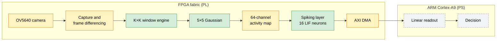

# NeuroFPGA

A camera-to-decision object tracker I am building on a single Zynq-7020 board.

The FPGA fabric does the pixel-level work. A spiking neural network turns image activity into spike counts. A small linear readout on the ARM Cortex-A9 will turn those counts into a decision. The goal is to retarget the tracker to a new task by retraining only the readout, without rebuilding the bitstream.

This is a work in progress. The sections below separate what is built and tested, what I am building now, and what is only planned.

## Status

| Component | Status | Evidence |
|---|---|---|
| K×K sliding-window engine | Built and tested | `tb_window` passes |
| Separable 5×5 Gaussian (shift-add, zero DSP) | Built and tested | `tb_stage_gauss` passes on 4,096 of 4,096 pixels; out-of-context synthesis uses 0 DSP blocks |
| 16-neuron LIF spiking layer | Built and tested for a single inference | `tb_lif` passes; every spike count matches the Python golden model |
| OV5640 camera front end | In progress | Sensor configuration RTL is written; capture and frame differencing are not finished |
| PS7 block design with AXI DMA | In progress | `scripts/bd_system.tcl` is scripted; not brought up on the board |
| FreeRTOS on the Cortex-A9 | In progress | Kernel bring-up has started; it does not run yet |
| Linear readout on the Cortex-A9 | Planned | |
| Recurrent reservoir (Liquid State Machine) | Planned, gated | Built only if it beats the feed-forward layer (see Roadmap) |
| End-to-end camera-to-decision loop on the board | Planned | |

"Built and tested" means the block has a self-checking testbench that passes in Vivado xsim. None of the blocks has run on the board yet.

## Target architecture



Green is built and tested in simulation. Yellow is in progress. Grey is planned.

## What is built

### K×K sliding-window engine

File: `rtl/common/window_kxk.v`

- It turns a pixel stream into a K×K window around each pixel. K can be 3 or 5. Image width, image height and pixel width are parameters.
- The line buffers are K−1 banks of distributed RAM, one array per bank. Each new row is written into one bank, and the banks rotate from row to row.
- All banks are read asynchronously in the same clock cycle. That is why the line buffers use distributed RAM instead of shift registers or block RAM.
- Pixels outside the image are treated as zero, which matches the Python golden model.
- The engine takes one pixel per clock cycle and never applies backpressure. The input stream must leave at least 2·⌊K/2⌋ idle cycles between rows, so the engine can shift in the padding zeros.

### Separable 5×5 Gaussian

File: `rtl/img_proc/gaussian_5x5.v`

- The kernel is [1,4,6,4,1] ⊗ [1,4,6,4,1] / 256, applied as a row pass and then a column pass.
- Every coefficient is a sum of powers of two, so every multiply becomes a shift-add. The 25 multiplies of a direct 5×5 kernel reduce to 10 adds.
- The output is `clamp((acc + 128) >> 8, 0, 255)`, the same rounding the golden model uses.

Out-of-context synthesis with Vivado 2025.2 on xc7z020, default parameters (640×480):

| Resource | Used |
|---|---|
| LUTs | 1,031 |
| of which distributed RAM (line buffers) | 320 |
| of which shift registers | 2 |
| Flip-flops | 982 |
| DSP48 blocks | 0 |
| Block RAM | 0 |

### LIF spiking layer

Files: `rtl/snn/spike_encoder.v`, `rtl/snn/synapse_array.v`, `rtl/snn/lif_neuron.v`, `rtl/snn/snn_top.v`

- There are 64 input channels, each with an 8-bit activity value. The encoder uses deterministic rate coding: input *j* spikes at time step *t* when *t* < act[*j*].
- The layer has 16 leaky integrate-and-fire neurons and runs 64 time steps per inference.
- The membrane potential is Q8.16. The leak is `v − (v >> 4)`, an arithmetic shift, so no multiplier is needed. After a spike, the neuron resets to 0 and stays refractory for 2 steps. The potential saturates at −128 and 127.
- The 64×16 INT8 weights are fixed and stored in block ROM (`mem/weights_snn.hex`). A single time-multiplexed accumulator sums the synaptic inputs.
- The output is one spike count per neuron.
- The layer is feed-forward. It has no recurrent connections yet.

### Python golden models

- `scripts/golden_model_snn.py` mirrors the spiking layer's arithmetic bit for bit: encoding, Q8.16 integration, shift leak, refractory period and saturation.
- `scripts/golden_model.py` computes the image pipeline in Python and writes the reference output for the Gaussian (`sim/reference/gauss.hex`).
- The testbenches compare the RTL output against these references, value by value.

### Known limitation

`run_start` clears the spike counters, but not the membrane potentials or the refractory counters. The golden model starts every inference from zero. So a second inference without a reset drifts away from the model. `tb_lif` runs only one inference, so it does not catch this. Fixing it is the first item on the roadmap.

## In progress

### OV5640 camera front end

Files: `rtl/sensor/`

- The sensor configuration logic (`sccb_master.v`, `ov5640_ctrl.v`, `ov5640_init_table.vh`) is written. It has not been tested on the board.
- Capturing frames into the pipeline is not finished.
- Frame differencing is not finished. Its purpose is to approximate event-camera input with a conventional sensor.

### Processing system side

- `scripts/bd_system.tcl` scripts a block design with the Zynq PS7, an AXI SmartConnect and an AXI DMA. It has not been brought up on the board.
- I have started bringing up FreeRTOS on the Cortex-A9. It does not run yet.

## Roadmap

1. **Fix the inference state reset.** Clear the membrane potentials and refractory counters on `run_start`. Extend `tb_lif` to run several inferences in a row.
2. **Finish the camera path.** Capture OV5640 frames, add frame differencing, and drive the window engine from the live sensor.
3. **Bring up the processing system.** Get FreeRTOS running on the Cortex-A9 and move spike counts to it over AXI DMA.
4. **Model before building.** In Python, compare three options on the same task: a simple non-learned baseline, the current feed-forward layer with a linear readout, and a recurrent Liquid State Machine reservoir with a linear readout.
5. **Build the reservoir only if it wins.** If the reservoir beats the feed-forward layer, add fixed random recurrent connections in RTL. If it does not, keep the feed-forward layer.
6. **Train the readout.** Fit a linear readout with ridge regression on recorded spike counts, and run it in fixed point on the Cortex-A9. Retargeting to a new task should then need only new readout weights.
7. **Close the loop on the board.** Camera in, decision out, with measured latency and resource use.

## Repository layout

```
rtl/
  common/window_kxk.v        K×K sliding-window engine
  img_proc/gaussian_5x5.v    separable 5×5 Gaussian
  snn/spike_encoder.v        rate encoder
  snn/synapse_array.v        INT8 weight ROM
  snn/lif_neuron.v           LIF neuron
  snn/snn_top.v              16-neuron spiking layer
  sensor/                    OV5640 configuration (in progress)
mem/
  weights_snn.hex            spiking layer weights
scripts/
  gen_test_image.py          test image generator
  golden_model.py            image pipeline reference
  golden_model_snn.py        spiking layer reference
  bd_system.tcl              PS7 + AXI DMA block design (in progress)
sim/
  tb/                        tb_window.sv, tb_stage_gauss.sv, tb_lif.sv
  stimulus/                  act_64.hex, test_image_64x64.hex
  reference/                 gauss.hex
```

## Running the tests

You need Vivado 2025.2 (for `xvlog`, `xelab` and `xsim`) and Python 3. Run these from the repository root.

Generate the stimulus and the reference outputs:

```bash
mkdir -p out
python scripts/gen_test_image.py --size 64 --pattern edge --out sim/stimulus/test_image_64x64.hex
python scripts/golden_model.py --in sim/stimulus/test_image_64x64.hex --size 64 --out sim/reference/golden_output.hex --dump-dir sim/reference
python scripts/golden_model_snn.py --act sim/stimulus/act_64.hex --out out/golden_snn.hex
```

Compile, elaborate and run the three testbenches:

```bash
xvlog -sv rtl/common/window_kxk.v rtl/img_proc/gaussian_5x5.v rtl/snn/spike_encoder.v rtl/snn/synapse_array.v rtl/snn/lif_neuron.v rtl/snn/snn_top.v sim/tb/tb_window.sv sim/tb/tb_stage_gauss.sv sim/tb/tb_lif.sv
for tb in tb_window tb_stage_gauss tb_lif; do xelab $tb -s sim_$tb -debug off && xsim sim_$tb --runall; done
```

Expected output:

```
=== tb_window: PASS ===
=== tb_gauss: PASS (4096 px) ===
=== tb_lif: PASS (16 neurons, 64 steps, counts bit-exact) ===
```

Last run: September 13, 2026, with Vivado 2025.2.

## Tools

Verilog and SystemVerilog, Vivado 2025.2 (synthesis and xsim), Python 3, and C for the processing system side (in progress). Target part: Zynq-7020 (xc7z020).
